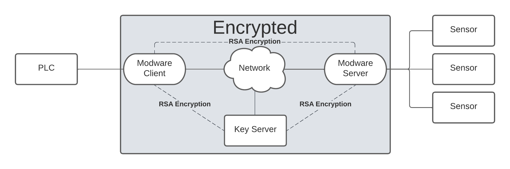
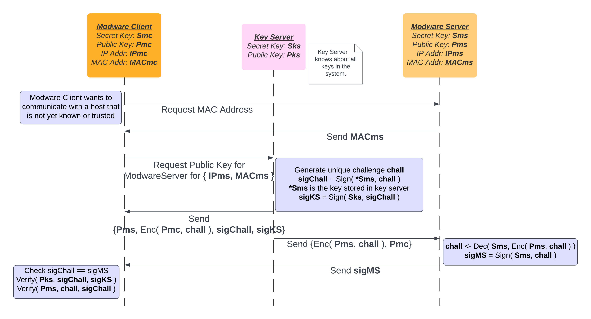
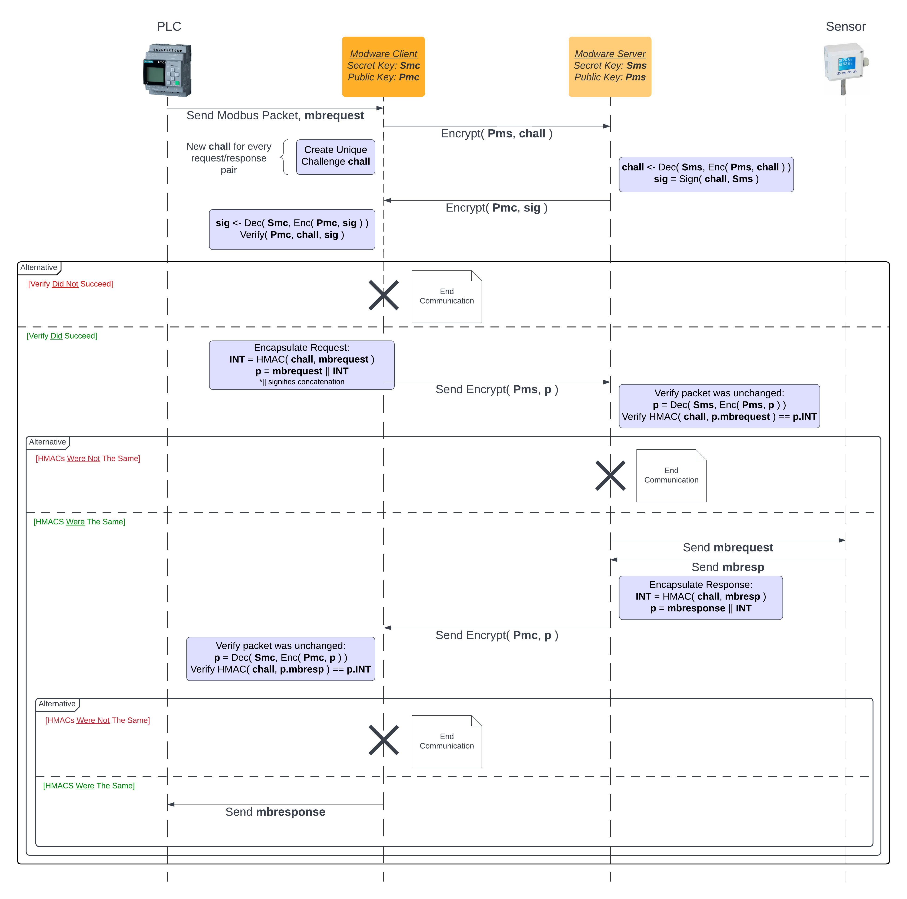

# Modware
This project was developed for the 2255 CSEC-741-01 Internet of Things Security calss of the Spring 2022 semester. 



Our project seeks to develop an unobtrusive client/server middleware solution that enables secure communication without intrusive modifications to the existing hardware or extensive time investment for integration. Recognizing that the data transmitted by Modbus devices is intrinsically insecure, our middleware is strategically designed to be positioned in close proximity to the devices, preferably on the same switch or even in line. This approach minimizes the duration of unencrypted traffic, significantly reducing the window of vulnerability.

A core objective of our project is to address the security challenges inherent in legacy and resource-constrained industrial systems, which often lack the capacity to support advanced cryptographic processes. By implementing this middleware solution, we strive to offer a seamless yet robust layer of protection for these systems without disrupting their normal operations.

Furthermore, our project aims to facilitate the adoption of secure communication practices in various industrial settings by offering a cost-effective and easily deployable solution. This middleware can be scaled across different environments, making it a versatile security enhancement for a wide range of industrial control systems that rely on protocols with limited built-in security measures.

Ultimately, our research endeavors to contribute to the broader understanding of cybersecurity in industrial contexts, while providing practical solutions for organizations seeking to bolster their security infrastructure without significant disruption or financial burden.

## Protocol Design
The protocol design has 2 separate tasks. First, a Verify Host protocol flow where the ModwareClient learns and verify authenticity of a ModwareServer. Second, a protocol flow of a ModwareClient that has verified a previous ModwareServer. The first image depicts the `Verify Host` protocol flow, and the second image depcits the `Verified Communication` protocol flow. 


- The `Verify Host` protocol flow


- The `Verified Communication` protocol flow

## ModwareClient
The ModwareClient is divided into three parts: Initialization, `Verify Host`, and `Verified Communication`. During initialization, ModwareClient loads its keys, binds to a server socket, and waits for a Modbus client device request. In `Verify Host`, ModwareClient checks the destination address and performs a client-side protocol to verify the ModwareServer using the KeyServer's challenge signature. Once verified, the ModwareClient proceeds to the `Verified Communication` phase, where it communicates securely with the ModwareServer using a unique challenge encrypted with the server's public key. The Modbus request is encrypted, encoded, and sent to the network. Upon receiving a response, ModwareClient decrypts it, verifies it, and forwards it to the Modbus client device.

## ModwareServer
The ModwareServer is divided into three parts: Initialization, `Verify Host`, and `Verified Communication`. Upon start-up, the ModwareServer loads its public and private keys into memory and listens for incoming connections from ModwareClients. If the payload is a MAC address request, the ModwareServer responds with its MAC address and waits for a connection from the KeyServer to enact the `Verify Host` flow.

If `Verified Communication` is taking place, the ModwareServer extracts the source IP from the packet, looks up the associated public key for the ModwareClient device, decrypts the packet, signs the challenge, and sends it out over the network. If the generated HMAC matches the expected HMAC, the ModwareClient forwards the Modbus request to the device, receives the response, and sends it back to the ModwareServer. Finally, the ModwareServer generates an HMAC for the Modbus response, combines it with the Modbus response into a struct, and sends it back to the ModwareClient.

## KeyServer
The KeyServer is responsible for distributing keys and is divided into two parts: initialization and `Verify Host`. Upon startup, it loads its public and private keys into memory and binds to a server socket on port 5020. If a message is received, the KeyServer decodes it and uses the source IP address to load the public key of the ModwareClient. It then loads the public and private keys of the ModwareServer into memory, generates a unique challenge, signs it with the private key from the ModwareServer, and sends it back to the ModwareClient.

# How to build and run
1. To build and run the ModwareClient
```
cd client/
go run client
```
2. To build and run the ModwareServer
```
cd server
go run server
```

3. To build and run the KeyServer
```
cd key-server
go run key-server
```

# Example architecture 
